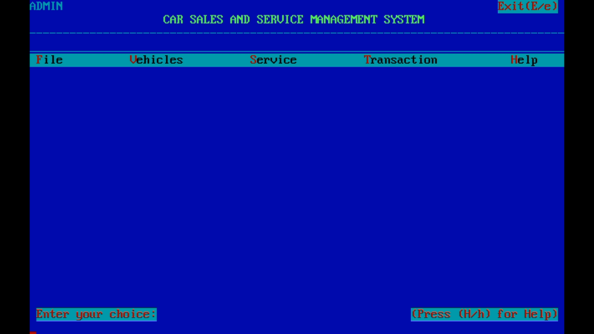
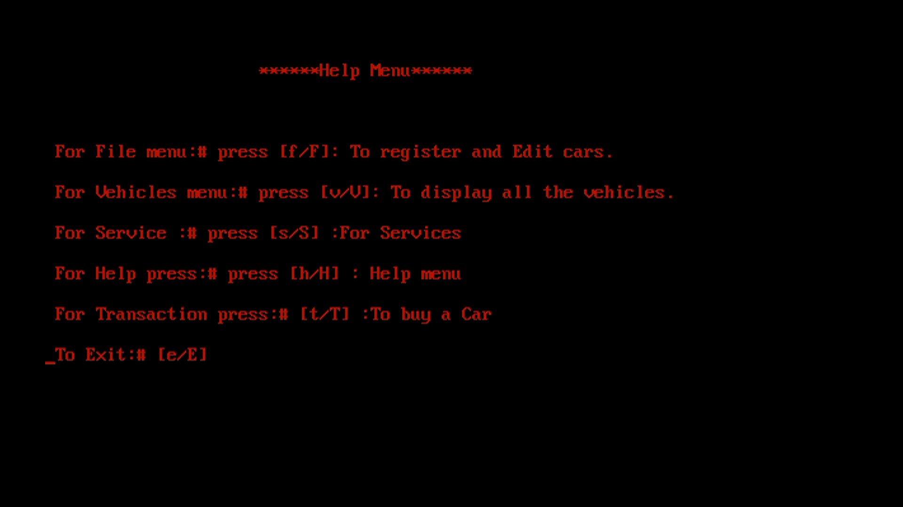
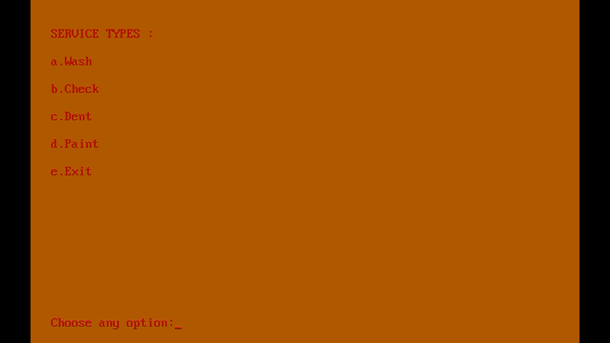
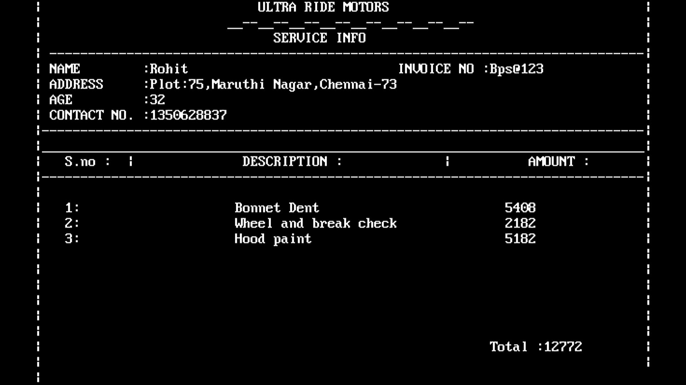

# CAR SALES AND SERVICES MANAGEMENT SYSTEM C++ PROJECT

## About The Project
### Built With
* C++
* IDE : [Turbo C++](https://developerinsider.co/download-turbo-c-for-windows-7-8-8-1-and-windows-10-32-64-bit-full-screen/)
#### Header Files used
```cpp
#include<iostream.h>
#include<conio.h>
#include<stdio.h>
#include<process.h>
#include<fstream.h>
#include<dos.h>
#include<string.h>
#include<ctype.h>
```
### Screenshots






<!-- CONTACT -->
## Contact
KS AHAMED KABEER 

[LinkedIn](https://www.linkedin.com/public-profile/settings?trk=d_flagship3_profile_self_view_public_profile&lipi=urn%3Ali%3Apage%3Ad_flagship3_profile_self_edit_top_card%3B7ENY2z0sTxGYiKpY8NQTag%3D%3D)

ahamedkabeer279@gmail.com

## Other Project Members

* [Abinanth](https://www.instagram.com/abinanth05/)
* [Akshay Mahadev](#)

## Acknowledgements
* Programming with C++ : Sumitha Arora
* Cover Page Idea : Product Management System[Missing]
* Teacher : Dr Gayathree Mam
* Friends who supported me


<!-- MARKDOWN LINKS & IMAGES -->
<!-- https://www.markdownguide.org/basic-syntax/#reference-style-links -->
[contributors-shield]: https://img.shields.io/github/contributors/othneildrew/Best-README-Template.svg?style=for-the-badge
[contributors-url]: https://github.com/othneildrew/Best-README-Template/graphs/contributors
[forks-shield]: https://img.shields.io/github/forks/othneildrew/Best-README-Template.svg?style=for-the-badge
[forks-url]: https://github.com/othneildrew/Best-README-Template/network/members
[stars-shield]: https://img.shields.io/github/stars/othneildrew/Best-README-Template.svg?style=for-the-badge
[stars-url]: https://github.com/othneildrew/Best-README-Template/stargazers
[issues-shield]: https://img.shields.io/github/issues/othneildrew/Best-README-Template.svg?style=for-the-badge
[issues-url]: https://github.com/othneildrew/Best-README-Template/issues
[license-shield]: https://img.shields.io/github/license/othneildrew/Best-README-Template.svg?style=for-the-badge
[license-url]: https://github.com/othneildrew/Best-README-Template/blob/master/LICENSE.txt
[linkedin-shield]: https://img.shields.io/badge/-LinkedIn-black.svg?style=for-the-badge&logo=linkedin&colorB=555
[linkedin-url]: https://linkedin.com/in/othneildrew
[product-screenshot]: images/screenshot.png
